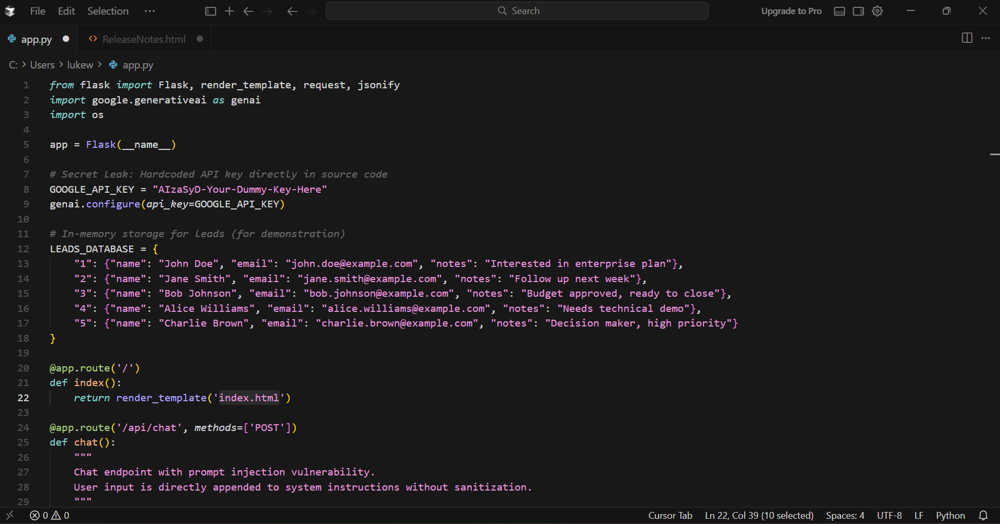
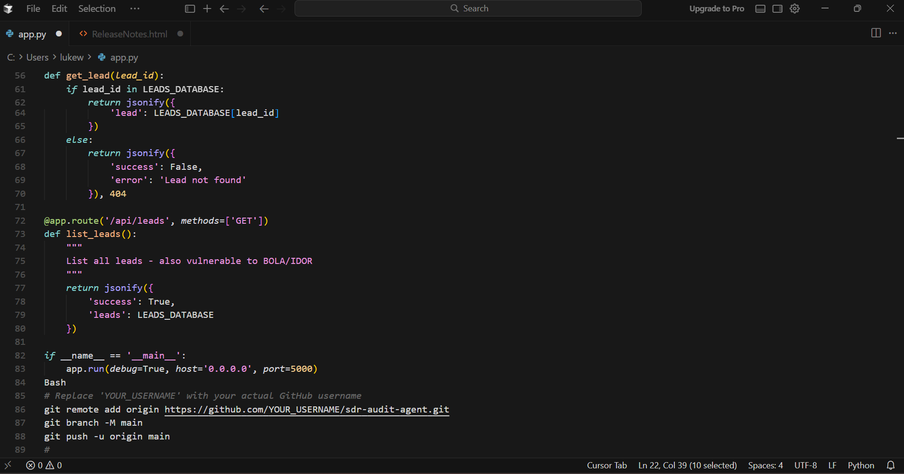
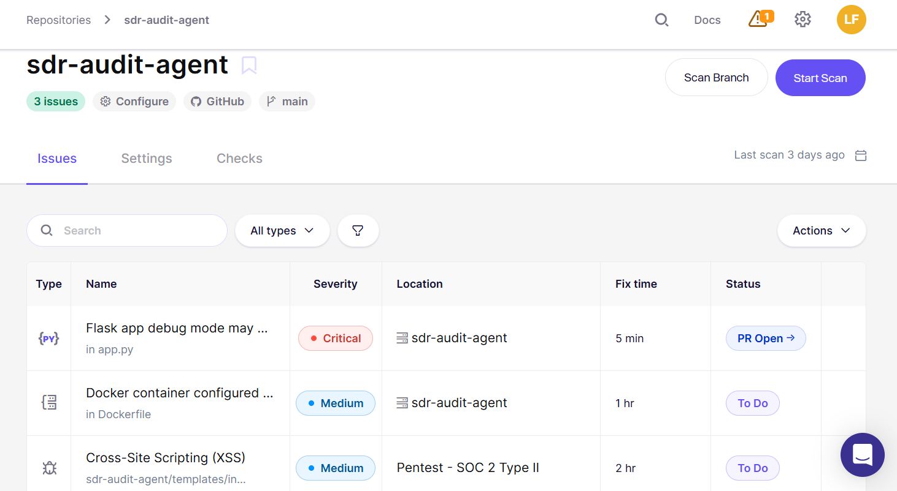
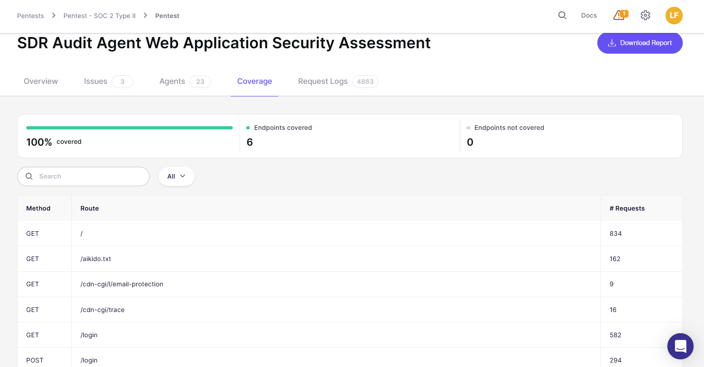
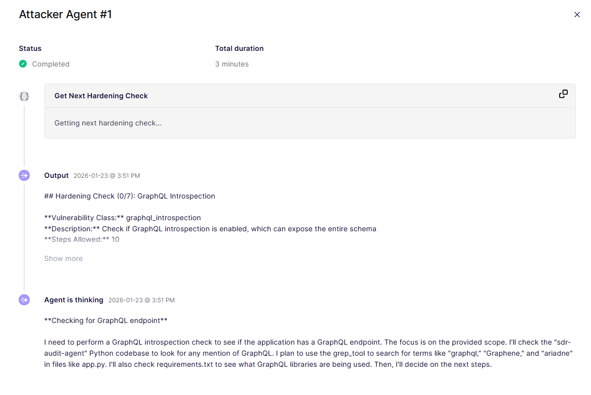
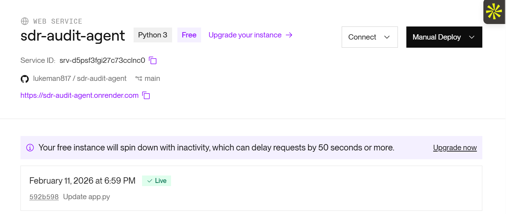

# 🤖 SDR Audit Agent: A Study in AI-Native Vulnerabilities

### **Overview**
This project is a proof-of-concept AI agent built using "vibe coding" (Cursor + LLM-assisted development). The goal was to build a functional tool for auditing SDR outreach while intentionally observing how rapid, AI-assisted development can introduce significant security "noise" and vulnerabilities into the SDLC.

**Live Demo:** [https://sdr-audit-agent.onrender.com](https://sdr-audit-agent.onrender.com)

---

### **The Stack**
* **IDE:** Cursor (AI-Native Code Editor)
* **Language:** Python / Flask
* **LLM:** Google Gemini 1.5 Pro / Flash
* **Deployment:** Render
* **Database:** Local dictionary (simulating a production `LEADS_DATABASE`)
* **Tooling & Verification:** This project was used to test the ingestion and 'vulnerability noise' levels of modern ASPM and developer-first security platforms (e.g., **Aikido Security**) to better understand the practitioner's workflow.

---

### **Security Findings (The "Pentest" Perspective)**
As an Enterprise AE in the AppSec space, I built this to better understand the developer's experience when balancing speed vs. security. I identified three critical categories of vulnerabilities that modern AI-native security platforms must address:

#### **1. Prompt Injection & Secret Leak**
Because the agent directly appends user-provided audit notes to the system prompt without sanitization, it is susceptible to prompt injection. Additionally, the rapid "vibe coding" phase makes it easy to hardcode API keys directly into the source.

* **Status:** Identified in `app.py`.

#### **2. Broken Object Level Authorization (BOLA / IDOR)**
The initial lead retrieval logic relied on predictable integer IDs. In a production environment without proper session validation, a user could manipulate the `lead_id` to access sensitive PII of other leads.

* **Status:** Identified in lead retrieval routes.

---

### **Business Value & Risk Impact**
I look at these technical flaws through the lens of business risk:
* **Compliance & Trust:** The identified **BOLA** vulnerability represents a critical risk to customer trust and regulatory compliance (GDPR/SOC2/CCPA), as it allows for unauthorized PII extraction with minimal effort.
* **Operational Integrity:** **Prompt Injection** risks can lead to data exfiltration or manipulation of automated business logic, potentially causing brand damage in an agentic workflow.
* **Security Debt:** **Secret Sprawl** represents latent risk; hardcoded keys are a primary vector for supply chain attacks.

---

### **Validation & Automated Scanning**
To validate these findings, I integrated this repository with **Aikido Security** to perform an automated Web Application Security Assessment.

#### **Scan Summary**
The automated scan successfully identified the critical risk of running in Flask Debug Mode and validated the presence of Cross-Site Scripting (XSS) vulnerabilities.

#### **Endpoint Coverage**
The scan achieved **100% coverage** across all 6 endpoints, ensuring that every route—from the logic-heavy `/chat` to the verification `/aikido.txt`—was audited.

#### **Agentic AI Logic**
Most interestingly, I utilized **Agentic AI Attacker Agents** to perform hardening checks, such as GraphQL introspection, demonstrating how AI-native tools are becoming the new standard for securing rapid-deployment workflows.

---

### **Deployment**
The application is continuously deployed via **Render**, providing a live environment to test these vulnerabilities in a real-world setting.

---

### **Why I Built This**
I believe the next generation of security disruption isn't just about finding bugs—it's about **automated guardrails**. As development moves at the speed of Agentic AI, the security industry must provide tools that integrate seamlessly into the developer's workflow (like Cursor) to ensure we aren't shipping "vulnerable by design" software.

---

### **Getting Started**
1.  **Clone the repo:** `git clone https://github.com/lukeman817/sdr-audit-agent`
2.  **Install requirements:** `pip install -r requirements.txt`
3.  **Environment Variables:** Add your API key to a `.env` file (not provided in repo).
4.  **Run locally:** `python app.py`

---

### **Connect with me**
**LinkedIn:** [linkedin.com/in/fergusonluke](https://www.linkedin.com/in/fergusonluke/) | **Email:** lukeferguson817@gmail.com

---
*Disclaimer: This application is intentionally vulnerable and was built for educational and demonstration purposes. Do not use this code in a production environment without implementing proper security guardrails.*
